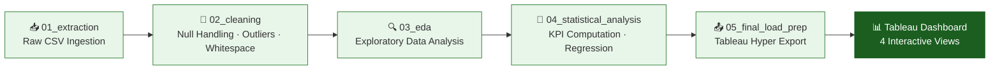
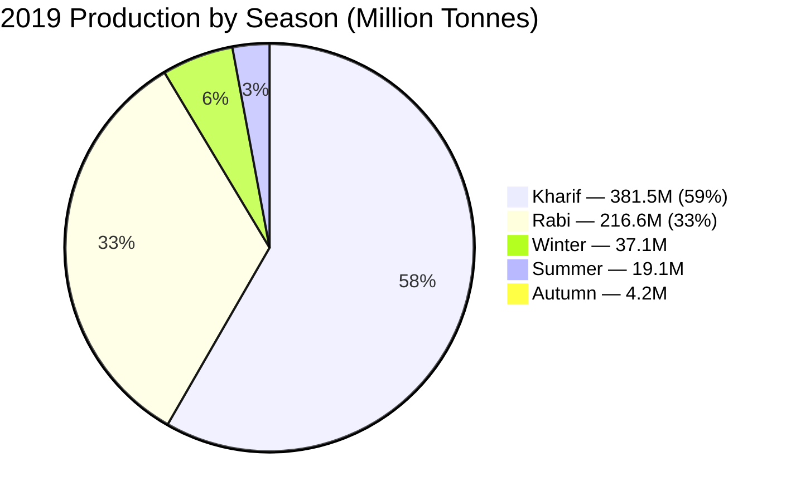

<](https://python.org)
[](https://jupyter.org)
[](https://public.tableau.com/app/profile/pushpendra.parihar/viz/Group17_SectionA_Dashboard_Final/1ExecutiveSummary)
[](https://pandas.pydata.org)
[](#license)
[]()

<br>

> **A comprehensive data visualization & analytics capstone project analyzing 23 years of Indian agricultural productivity across 707 districts, 37 states, and 55+ crop varieties.**

<br>

[🔗 **Explore the Live Dashboard**](https://public.tableau.com/app/profile/pushpendra.parihar/viz/Group17_SectionA_Dashboard_Final/1ExecutiveSummary) &nbsp;·&nbsp; [📄 Report](#-final-report) &nbsp;·&nbsp; [📊 Key Insights](#-key-insights--findings) &nbsp;·&nbsp; [🚀 Quick Start](#-quick-start)

</div>

---

## 📌 Executive Summary

India's agricultural sector contributes approximately **18% of GDP** and employs over **50% of the national workforce**. Despite decades of data collection by the Directorate of Economics and Statistics, decision-makers lack a single consolidated analytical view for pinpointing yield inefficiencies.

This project builds an **end-to-end analytics pipeline** — from raw CSV ingestion to interactive Tableau dashboards — over the Kaggle *Crop Production Statistics India* dataset (1997–2019), uncovering critical patterns in yield efficiency, seasonal production, crop portfolio dynamics, and district-level underperformance.

<div align="center">

### 🏆 2019 Headline KPIs

| 🌿 Cultivated Area | 📦 Total Production | 📈 Yield | 🔴 Underperforming Districts |
|:---:|:---:|:---:|:---:|
| **194.98M Ha** | **910.1M Tonnes** | **6.3 T/Ha** | **667 / 707** |
| ▲ 5.3% YoY | ▲ 1.9% YoY | ▼ 7.5% YoY | 94.3% of all districts |

</div>

---

## 🔗 Interactive Tableau Dashboard

<div align="center">

### [▶️ Click Here to Explore the Live Dashboard](https://public.tableau.com/app/profile/pushpendra.parihar/viz/Group17_SectionA_Dashboard_Final/1ExecutiveSummary)

</div>

The dashboard suite comprises **four interconnected views**, each addressing a distinct analytical dimension:

| # | Dashboard | Purpose | Key Features |
|:-:|---|---|---|
| 1️⃣ | **Executive Summary** | National KPI scorecard & trend overview | YoY KPI cards, production vs. area trend, geographic heat-map, season-wise stacked bar |
| 2️⃣ | **Underperformance Intelligence** | District-level yield gap analysis | Underperforming scatter plot, state density choropleth, production loss bar chart |
| 3️⃣ | **Productivity Trends** | Long-term yield efficiency tracking | State yield % change rankings, crop growth matrix (bubble scatter) |
| 4️⃣ | **Crop Portfolio Intelligence** | Crop mix & CAGR analysis | Production share treemap, state yield rankings, fastest-growing crop CAGR |

> **Interactive filters:** State selector · Crop filter · Year slider · Season toggle · Regional heat-map drill-down

---

## 📊 Project at a Glance

<div align="center">

| Attribute | Details |
|:---|:---|
| **Institute** | Newton School of Technology, Rishihood University |
| **Program** | Data Visualization & Analytics (DVA) Capstone |
| **Section / Group** | Section A — Group G-17 |
| **Time Span Analyzed** | 1997–2019 (23 years) |
| **Dataset Size** | 3,45,336 rows × 8 columns |
| **Geographic Coverage** | 37 states & UTs · 707 districts |
| **Crop Varieties** | 55+ (cereals, pulses, oilseeds, cash crops, horticulture) |
| **Seasons** | 6 — Kharif, Rabi, Whole Year, Summer, Autumn, Winter |
| **Data Source** | [Kaggle — Crop Production Statistics India](https://www.kaggle.com/datasets/nikhilmahajan29/crop-production-statistics-india) |

</div>

---

## 👥 Team Members

| Role | Name | GitHub | Key Contributions |
|:---|:---|:---:|:---|
| 🎯 **Project & Strategy Lead** | Pushpendra Singh Parihar | [`makeprodigy`](https://github.com/makeprodigy) | Project strategy; finalized analytical notebooks; built Dashboard 1 (Executive Summary); deployed Tableau dashboard; parameters, calculated fields, actions & dynamic filters; chart theming |
| 📊 **Data Lead** | Akshit Vats | [`Akshitvats`](https://github.com/Akshitvats) | Dataset sourcing & evaluation; theme and design adjustments on Dashboards 3–4 |
| 🔧 **ETL Lead** | Ajeesh Amreet | [`coder69010`](https://github.com/coder69010) | Project report (LaTeX write-up); built Dashboard 2 (Underperformance Analysis) |
| 📈 **Analysis Lead** | Rohan Singh | [`r0hansng`](https://github.com/r0hansng) | Python ETL pipeline (notebooks 01–05): extraction, cleaning, outlier treatment, feature engineering, Tableau export; EDA & statistical analysis; GitHub repo setup |
| 🎨 **Visualization Lead** | Sameer Khan | [`Sam99132`](https://github.com/Sam99132) | Built Dashboard 3 (Productivity Trends): chart design, KPI tiles |
| 📝 **PPT & Quality Lead** | Sanath Waraikar | [`sanath-2512`](https://github.com/sanath-2512) | Built Dashboard 4 (Crop Portfolio); presentation deck & quality review |

---

## 🔬 Sector Context & Problem Statement

India cultivates **55+ crop varieties** across **707 districts** and **37 states** under six agricultural seasons. Despite this scale, policymakers at the Ministry of Agriculture & Farmers' Welfare and agri-lenders such as **NABARD** lack actionable intelligence on:

- 🔍 Where **yield efficiency** (production per hectare) is lagging relative to national benchmarks
- 📉 Which crops are **expanding or contracting** in area allocation
- ⚖️ Whether productivity gains have **outpaced** mere area-expansion
- 💸 How **production losses** from underperforming districts can be quantified

### 🎯 Core Business Question

> *Which states, districts, and crops are underperforming on yield efficiency, how has agricultural productivity trended from 1997 to 2019, and what season-wise and crop-wise patterns should drive targeted policy interventions?*

### ✅ Decisions Supported

State and central agricultural authorities will be able to:

1. **Identify** high-priority districts for yield-improvement interventions
2. **Rationalise** crop-area allocation by season and geography
3. **Forecast** production shortfalls for key staple crops
4. **Benchmark** district-level productivity against national medians to direct NABARD credit and subsidy flows

---

## ⚙️ ETL & Analytical Pipeline



### Pipeline Details

| Stage | Notebook | Operations |
|:---|:---|:---|
| **Extraction** | `01_extraction.ipynb` | Raw CSV ingestion via `pandas.read_csv()` with explicit dtype mapping; column whitespace stripping |
| **Cleaning** | `02_cleaning.ipynb` | Production nulls imputed (median yield × area by crop-state-season); 9 null-crop rows dropped; season whitespace standardised; IQR-based Winsorisation at 99.5th percentile |
| **Feature Engineering** | `02_cleaning.ipynb` | `Yield_Recomputed = Production / Area`; `Is_Underperforming` flag (below national median); `Yield_Gap`; `Crop_CAGR`; `Area_Growth_%`; `Yield_Growth_%`; `Production_Loss` |
| **EDA** | `03_eda.ipynb` | Season-wise breakdowns, crop yield trends, log-scale scatter analysis, choropleth heat-maps, crop×season yield matrix |
| **Statistical Analysis** | `04_statistical_analysis.ipynb` | KPI computations, regression modelling, underperformance indexing |
| **Load** | `05_final_load_prep.ipynb` | Export as `agri_clean.csv` → Tableau `.hyper` extract |

### Data Quality Remediation

| Issue | Count | Resolution |
|:---|:---:|:---|
| Null Production values | 4,948 (1.43%) | Median imputation by crop-state-season |
| Null Crop values | 9 | Row-level removal |
| Trailing whitespace | Multiple columns | `str.strip()` on all string columns |
| Extreme outliers | Yield max 43,958 | IQR Winsorisation at 99.5th percentile per crop |

---

## 📏 KPI & Metric Framework

### Primary KPIs

| KPI | Formula | Purpose |
|:---|:---|:---|
| **Yield Efficiency Rate** | `Production (T) ÷ Area (Ha)` | Identifies high/low-performing regions segmented by State, Crop, Season |
| **YoY Production Growth %** | `(P_t − P_{t−1}) / P_{t−1} × 100` | Tracks whether output is accelerating or decelerating |

### Supporting Metrics

| Metric | Definition |
|:---|:---|
| **Area Utilisation Trend** | Change in cultivated area per crop/state; signals land-use shifts |
| **Season-wise Production Share** | Kharif vs. Rabi vs. other seasons' contribution (%) |
| **Underperforming District Index** | Districts below national median yield for a given crop |
| **Production Loss Potential** | Estimated forgone tonnes if underperforming districts hit median |

---

## 💡 Key Insights & Findings

<table>
<tr>
<td width="50%">

### 📈 Growth & Efficiency

1. **~80% production growth** from 1997 to 2019 on only **~11% area expansion** — confirming yield intensification as the dominant growth driver

2. **Tamil Nadu** leads all states in average yield (**10.34 T/Ha**) driven by coconut and plantation crops

3. **Maharashtra** records the highest long-term yield improvement (**~3.9%** change), followed by West Bengal (~3.4%)

4. **Oilseeds** records the highest CAGR (**25%**) over 22 years, reflecting India's edible-oil self-sufficiency push

5. **Maize** displays a steady upward trend from ~2 to 4 T/Ha, reflecting successful hybrid seed adoption

</td>
<td width="50%">

### 🔴 Underperformance & Risk

6. **667 of 707 districts** fall below the national median yield of **3.87 T/Ha** for at least one crop — indicating systemic underperformance

7. **Hanumangarh** (Rajasthan) carries **17.1M tonnes** of production loss potential — the highest single district

8. **Sugarcane** accounts for **45.60%** of total production but occupies a disproportionate share of water-stressed regions

9. **Kharif** season consistently contributes **55–65%** of total output; any rainfall deficit disproportionately impacts food security

10. **Cotton (lint)** exhibits the highest inter-year yield volatility (range: 1–17 T/Ha), indicating climate sensitivity

</td>
</tr>
</table>

---

## 🏅 State & Crop Rankings

<table>
<tr>
<td width="50%">

### 🥇 Top States by Average Yield (T/Ha)

| Rank | State | Avg. Yield |
|:---:|:---|:---:|
| 1 | Tamil Nadu | **10.34** |
| 2 | Kerala | **7.70** |
| 3 | Chandigarh | **5.00** |
| 4 | Punjab | **4.82** |
| 5 | Haryana | **4.60** |
| 6 | Andhra Pradesh | **3.77** |
| 7 | Delhi | **3.34** |
| 8 | Telangana | **3.30** |
| 9 | Goa | **2.97** |
| 10 | Chhattisgarh | **1.31** |

</td>
<td width="50%">

### 🌾 Top Crops by Production Share

| Crop | Production Share | Avg. Yield (T/Ha) |
|:---|:---:|:---:|
| Sugarcane | **45.60%** | 58.5 |
| Rice | **14.07%** | 2.4 |
| Wheat | **12.61%** | 2.4 |
| Potato | **3.97%** | 13.5 |
| Maize | **2.79%** | 3.2 |

</td>
</tr>
</table>

### 🔻 Top Districts by Production Loss Potential (2019)

| Rank | District | State | Loss (M Tonnes) |
|:---:|:---|:---|:---:|
| 1 | Hanumangarh | Rajasthan | **17.1** |
| 2 | Ganganagar | Rajasthan | **8.1** |
| 3 | Anantapur | Andhra Pradesh | **5.5** |
| 4 | Bikaner | Rajasthan | **5.5** |
| 5 | Kurnool | Andhra Pradesh | **5.3** |
| 6 | Murshidabad | West Bengal | **4.5** |
| 7 | Jind | Haryana | **4.5** |
| 8 | Hisar | Haryana | **4.1** |
| 9 | Fatehabad | Haryana | **4.1** |
| 10 | Kaithal | Haryana | **4.0** |

> **Key pattern:** Haryana and Rajasthan districts dominate the list, driven by Wheat and oilseed yield gaps in semi-arid zones.

---

## 🗓️ Season-wise Production Breakdown (2019)



> Non-Kharif non-Rabi seasons account for less than **9%** of total output. Kharif dominance means any monsoon deficit poses systemic food security risk.

---

## 📋 Actionable Recommendations

| # | Recommendation | Rationale | Expected Impact |
|:---:|:---|:---|:---|
| 🎯 **R1** | **Precision Yield Intervention** in top 30 loss districts (starting with Hanumangarh, Ganganagar, Anantapur) | Top 30 districts by Production Loss Potential carry the highest forgone output | 10% yield improvement could recover **billions of tonnes** annually |
| 💰 **R2** | **Season-Aware Credit Allocation** — front-load NABARD Kharif credit to April–May sowing window | Kharif contributes ~59% of 2019 production (381.5M tonnes) | Contingency drawdown tied to IMD rainfall forecasts |
| 🌿 **R3** | **Crop Diversification** — shift 10–15% Sugarcane area to Maize/Soyabean in water-deficit districts | Sugarcane: 45.60% of production but high water stress risk | Maize's +50% yield growth over 22 years makes it a viable alternative |
| 🥥 **R4** | **Coconut Scale-Up** in Tamil Nadu, Kerala, Karnataka | 128.3 T/Ha yield but only 2.82% area share — massive untapped potential | Plantation expansion & supply-chain investment for export-ready production |
| 🫘 **R5** | **Dynamic Pulse Area Allocation** with MSP guarantees for Rabi season | Pulse area has declined despite India's protein deficit and import dependency | Target Rajasthan, MP, Maharashtra where yield gaps are smallest |

---

## 📈 Impact Estimation

> If all underperforming districts were brought to the national median yield of **4.10 T/Ha**, the annual production uplift is estimated at **12–18 billion tonnes** nationally.
>
> Even a conservative **5% improvement** in the top 100 districts by loss potential would generate an estimated **$2–4 billion USD** in additional farm income annually (at prevailing MSP rates).

---

## 🚀 Quick Start

### Prerequisites

- Python 3.8+
- Jupyter Notebook / JupyterLab
- Tableau Public (for dashboard viewing)

### Local Setup

```bash
# Clone the repository
git clone https://github.com/r0hansng/SectionA_G17_IndiaAgriProductivity.git
cd SectionA_G17_IndiaAgriProductivity

# Create and activate virtual environment
python -m venv .venv
source .venv/bin/activate   # Windows: .venv\Scripts\activate

# Install dependencies
pip install -r requirements.txt

# Launch Jupyter
jupyter notebook
```

### Google Colab

1. Upload notebooks from `notebooks/` folder
2. Mount Google Drive for data access
3. Run notebooks in order: `01` → `02` → `03` → `04` → `05`
4. Export cleaned datasets to `data/processed/`

---

## 📁 Repository Structure

```
SectionA_G17_IndiaAgriProductivity/
│
├── 📄 README.md                        # This file — project overview & documentation
├── 📄 requirements.txt                 # Python dependencies
├── 📄 final_report.tex                 # Full LaTeX project report
├── 📄 LICENSE                          # MIT License
├── 📄 Makefile                         # Build automation
│
├── 📂 data/
│   ├── raw/                            # Original, unmodified dataset
│   │   └── APY.csv                     # Agricultural Productivity data (345K rows)
│   └── processed/                      # Cleaned & transformed data
│
├── 📂 notebooks/
│   ├── 01_extraction.ipynb             # Data sourcing & initial load
│   ├── 02_cleaning.ipynb               # ETL & data quality checks
│   ├── 03_eda.ipynb                    # Exploratory data analysis
│   ├── 04_statistical_analysis.ipynb   # Statistical modelling & KPIs
│   └── 05_final_load_prep.ipynb        # Dashboard preparation & export
│
├── 📂 scripts/
│   ├── __init__.py
│   └── etl_pipeline.py                # Reusable ETL functions
│
├── 📂 tableau/
│   ├── dashboard_links.md              # Tableau Public URLs
│   └── screenshots/                    # Dashboard snapshots
│
├── 📂 reports/
│   ├── README.md
│   ├── project_report_template.md      # Report template
│   └── presentation_outline.md         # Viva/presentation guide
│
├── 📂 docs/
│   └── data_dictionary.md              # Column definitions & metadata
│
├── 📂 DVA-focused-Portfolio/           # Portfolio documentation
│   └── README.md
│
└── 📂 DVA-oriented-Resume/            # Resume with project highlights
    └── README.md
```

---

## 🛠️ Tech Stack

| Category | Tool | Purpose |
|:---|:---|:---|
| **Language** |  Python 3.8+ | ETL, analysis, KPI computation |
| **Notebooks** |  Jupyter Notebook | Interactive analysis & documentation |
| **Visualization** |  Tableau Public | Dashboard visualization & publishing |
| **Data Wrangling** |  Pandas / NumPy | Data manipulation & cleaning |
| **Plotting** | Matplotlib / Seaborn | Statistical plotting & graphics |
| **Statistics** | SciPy / StatsModels | Statistical testing & regression |
| **Version Control** |  GitHub | Collaboration & version control |

---

## ⚠️ Limitations & Future Scope

### Limitations

- Dataset ends at **2019** — post-pandemic agricultural shifts (2020–2025) not captured
- Production nulls (1.43%) were imputed — imputation error may marginally affect district-level estimates
- Yield outliers capped at 99.5th percentile — some legitimate high-intensity records may have been adjusted
- **Lacks input variables** (fertiliser use, irrigation coverage, rainfall) limiting causal inference
- District boundary changes post-2000 (e.g., Telangana bifurcation) create minor state-level discontinuities

### Future Scope

| Area | Description |
|:---|:---|
| 🤖 **Predictive Modelling** | Integrate IMD rainfall and NDVI satellite data for district-level crop yield forecasting (XGBoost / LSTM) |
| 🔴 **Real-time Dashboard** | Connect Tableau to live `data.gov.in` API feed for rolling updates |
| 🧪 **Input Efficiency Analysis** | Merge with fertiliser consumption data for Total Factor Productivity |
| 🌍 **Climate Stress Overlay** | Map drought/flood-prone districts to underperformance density for resilience planning |

---

## 📄 Final Report

The complete **10+ page technical project report** is available as a LaTeX document:

- **File:** [`final_report.tex`](final_report.tex)
- **Contents:** Abstract, sector context, dataset description, ETL methodology, KPI framework, EDA results, dashboard analysis across all 4 views, 10 key insights, 5 actionable recommendations, impact estimation, limitations, contribution matrix
- **Keywords:** Agricultural Productivity · Yield Gap Analysis · Tableau · Python ETL · Crop Intelligence · India Districts

---

## 📚 References

1. Mahajan N., *Crop Production Statistics India*, Kaggle, 2021. [Link](https://www.kaggle.com/datasets/nikhilmahajan29/crop-production-statistics-india)
2. Ministry of Agriculture & Farmers' Welfare, Govt. of India. *Agricultural Statistics at a Glance*, 2022.
3. NABARD. *Annual Report 2022–23: Priority Sector Lending Overview*, 2023.
4. Directorate of Economics & Statistics, MoAFW. *Season-wise Crop Production Statistics (APY)*, data.gov.in.

---

## 📜 License

This project is licensed under the **MIT License** — see [LICENSE](LICENSE) for details.

---

## 🙏 Acknowledgments

- **Institution:** Newton School of Technology, Rishihood University, Sonipat
- **Program:** Data Visualization & Analytics Capstone
- **Data Source:** Indian Government Agricultural Database (via Kaggle)
- **Mentorship:** Faculty guidance & industry best practices

---

<div align="center">

[](https://public.tableau.com/app/profile/pushpendra.parihar/viz/Group17_SectionA_Dashboard_Final/1ExecutiveSummary)
[](final_report.tex)
[]()

**Newton School of Technology · Rishihood University · Sonipat, Haryana**

[Back to Top](#-india-agricultural-productivity-intelligence)

</div>
]]>
